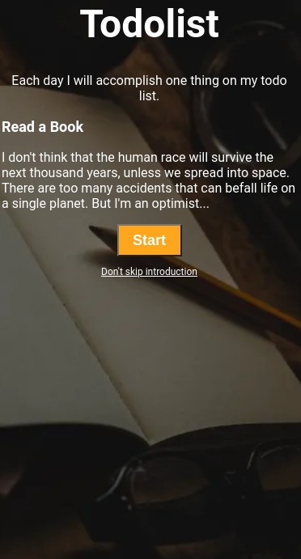

## Todolist

In this Project, let's build a Todolist.

**Refer to the below image.**

**Note:**

- Try to achieve the design as close as possible.

**Resources**
- Use this background image,
    - URL: https://d1tgh8fmlzexmh.cloudfront.net/ccbp-static-website/todolistbg.png

**CSS Colors used:**

- Background color for button:
    - orange

- Text color:
    - white

**CSS Font families used:**
- Roboto
