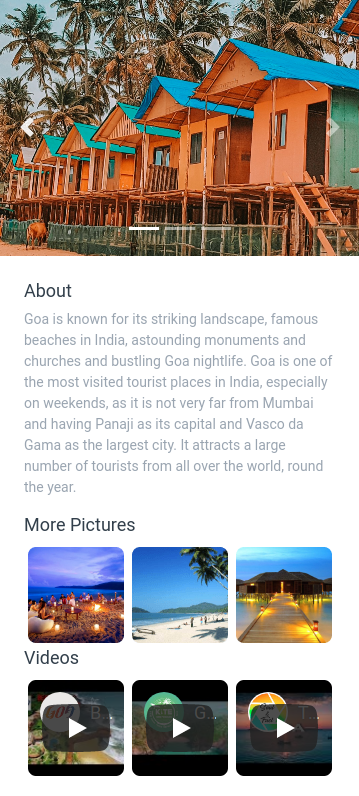
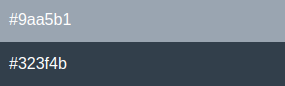

## Goa Page

In this Project, let's build a News Page. We can use the Bootstrap concepts as well.

Refer to the below image.

**Note:**

Try to achieve the design as close as possible.

**Resources**

Use the image URLs given below.

+ Carousel:
    - https://d1tgh8fmlzexmh.cloudfront.net/ccbp-static-website/goa-c1-img.png
    - https://d1tgh8fmlzexmh.cloudfront.net/ccbp-static-website/goa-c2-img.png
    - https://d1tgh8fmlzexmh.cloudfront.net/ccbp-static-website/goa-c3-img.png

**More Pictures:**

- https://d1tgh8fmlzexmh.cloudfront.net/ccbp-static-website/goa-more1-img.png
- https://d1tgh8fmlzexmh.cloudfront.net/ccbp-static-website/goa-more2-img.png
- https://d1tgh8fmlzexmh.cloudfront.net/ccbp-static-website/goa-more3-img.png

**Youtube Video URLs:**

- https://www.youtube.com/watch?v=NFalCkZAClY&ab_channel=GoaTourism
- https://www.youtube.com/watch?v=4irzfMfTmM8&ab_channel=EntrepreneursBeachFestivalIndia
- https://www.youtube.com/watch?v=OJu0gjzsvQE&ab_channel=SoulandFuel

**CSS Colors used:**

Text color Hex Code values:

**CSS Font families used:**
- `Roboto`

**Hint**
- To embed the Youtube Videos in a smaller size, replace the class name embed-responsive-16by9 with embed-responsive-1by1 in the Bootstrap Video Embed Code. You can find the reference here (https://getbootstrap.com/docs/4.5/utilities/embed/#aspect-ratios)