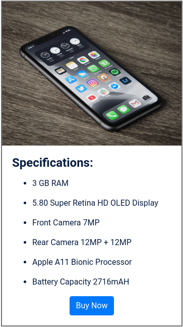

## Mobile Specifications Page

In this Project, let's build a News Page. We can use the Bootstrap concepts as well..

**Refer to the below image.**

**Note:**

Try to achieve the design as close as possible.
Resources

**Use the image given below.**
- URL: https://d1tgh8fmlzexmh.cloudfront.net/ccbp-static-website/iphoneX-bg.png

**CSS Colors used:**

Border/ Text color Hex Code values:
- 

**CSS Font families used:**
- `Roboto`