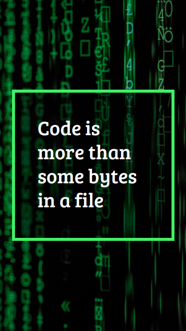

## Coding Cover Page

In this Project, let's build a Todolist.

**Refer to the below image.**

**Note:**
- Try to achieve the design as close as possible.

**Resources**
- Use this background image,
    - URL: https://d1tgh8fmlzexmh.cloudfront.net/ccbp-static-website/codingbg.png

**CSS Colors used:**

- Background color Hex Code value for card:
    - #00000080

- Border color Hex Code value for card:
    - #48ee59

**CSS Font families used:**
- Bree Serif
