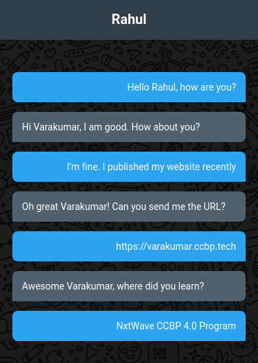

## Chat Page

In this Project, let's build a Todolist.

**Refer to the below image.**

**Note:**
- Try to achieve the design as close as possible.

**Resources**
- Use this background image,
    - URL: https://d1tgh8fmlzexmh.cloudfront.net/ccbp-static-website/chatbg.png

**CSS Colors used:**

- Text color Hex Code value:
    - #ffffff

- Background color Hex Code value for heading:
    - #323f4b

- Background color Hex Code values for Chat messages:
    - #47a3f3
    - #52606d

**CSS Font families used:**

- Roboto