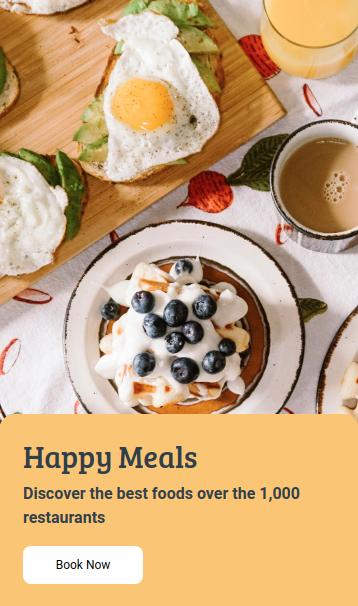

## Food Order Page

In this Project, let's build a Todolist.

**Refer to the below image.**

**Note:**
- Try to achieve the design as close as possible.

**Resources**
- Use this background image,
    - URL:  https://d1tgh8fmlzexmh.cloudfront.net/ccbp-static-website/foodbg.png

**CSS Colors used:**

- Background color Hex Code value for card:
    - `#f6c56e`

- Background color Hex Code value for Button:
    - `#ffffff`

- Text color Hex code value:
    - `#323f4b`

**CSS Font families used:**
- Main Heading
    - `Bree Serif`

- Paragraph and Button
    - `Roboto`