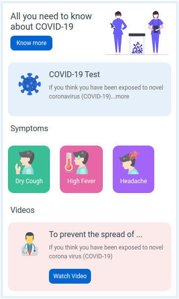
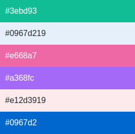
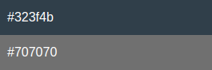

## COVID-19 Page

In this Project, let's build a News Page. We can use the Bootstrap concepts as well.

Refer to the below image.

**Note:**
Try to achieve the design as close as possible.

**Resources**

Use the image URLs given below.

- URL: https://d1tgh8fmlzexmh.cloudfront.net/ccbp-static-website/medicalcare-img.png

    - 

- URL: https://d1tgh8fmlzexmh.cloudfront.net/ccbp-static-website/coronavirus-img.png
    -  

- URL: https://d1tgh8fmlzexmh.cloudfront.net/ccbp-static-website/cough-img.png
    - 

- URL: https://d1tgh8fmlzexmh.cloudfront.net/ccbp-static-website/fever-img.png
    - 

- URL: https://d1tgh8fmlzexmh.cloudfront.net/ccbp-static-website/headache-img.png
    - 

- URL: https://d1tgh8fmlzexmh.cloudfront.net/ccbp-static-website/doctor-img.png
    - 

**CSS Colors used:**
- Background/ Border color Hex Code values:
    * 

- Text color Hex Code values:
    * 

**CSS Font families used:**

- Roboto