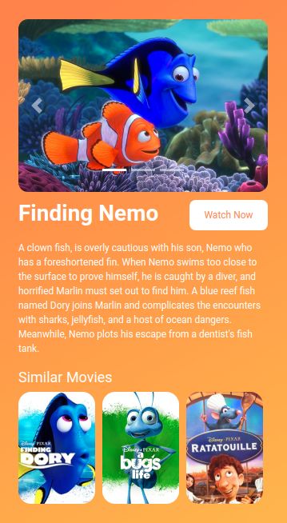

## Movie Page

In this Project, let's build a News Page. We can use the Bootstrap concepts as well..

**Refer to the below image.**

**Note:**

Try to achieve the design as close as possible.

**Resources**
Use the image URLs given below.

- Background Image:
    - https://d1tgh8fmlzexmh.cloudfront.net/ccbp-static-website/orange-color-bg.png

- Carousel:
    - https://d1tgh8fmlzexmh.cloudfront.net/ccbp-static-website/nemo-c1-img.png
    - https://d1tgh8fmlzexmh.cloudfront.net/ccbp-static-website/nemo-c2-img.png
    - https://d1tgh8fmlzexmh.cloudfront.net/ccbp-static-website/nemo-c3-img.png

- Similar Movies:
    - https://d1tgh8fmlzexmh.cloudfront.net/ccbp-static-website/finding-dory-img.png
    - https://d1tgh8fmlzexmh.cloudfront.net/ccbp-static-website/bugslife-img.png
    - https://d1tgh8fmlzexmh.cloudfront.net/ccbp-static-website/ratatouille-movie-img.png

**CSS Colors used:**

- Text color Hex Code values:
    - 

**CSS Font families used:**
- `Roboto`