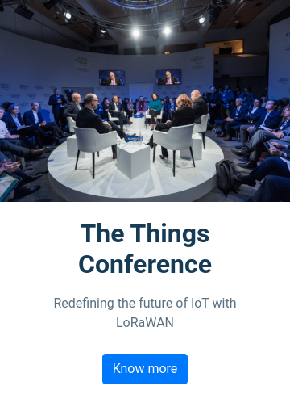
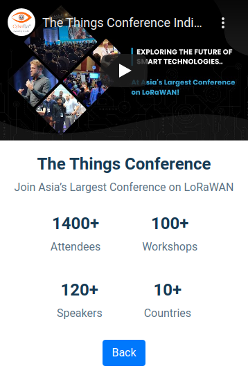
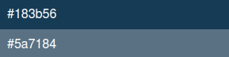

## Conference Page

In this Project, let's build a News Page. We can use the Bootstrap concepts as well..

**Refer to the below images.**

- Conference Home Page:
    - 

- Conference Details Page:
    - 

**Note**
- When clicked on the Know more button on the Conference Home Page, it must display the Conference Details Page.
- Try to achieve the design as close as possible.

**Important Note**

**Resources**
- Use the URLs given below.
    - Image URL: https://d1tgh8fmlzexmh.cloudfront.net/ccbp-static-website/conference-img.png
    - Youtube Video URL: https://youtu.be/vKJ6nXE_6Hc

**CSS Colors used**
- Text color Hex Code values:
    - 

- CSS Font families used:
    - `Roboto`