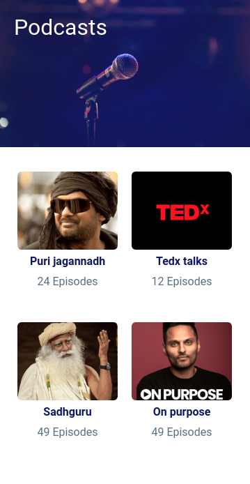
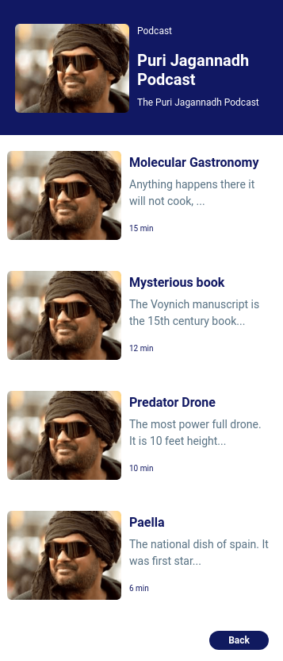
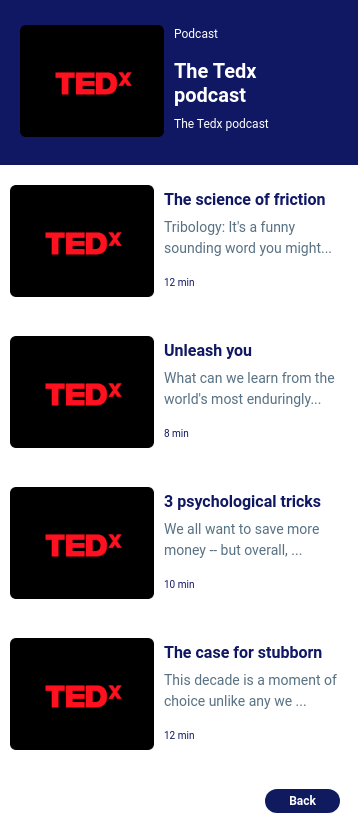
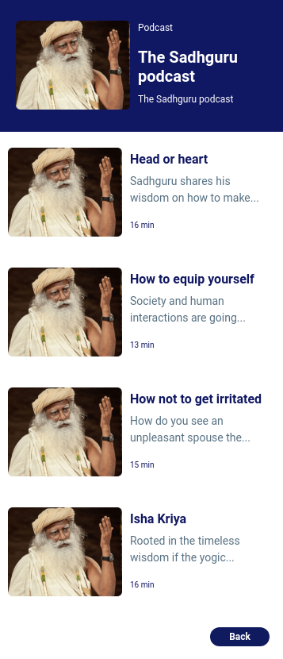
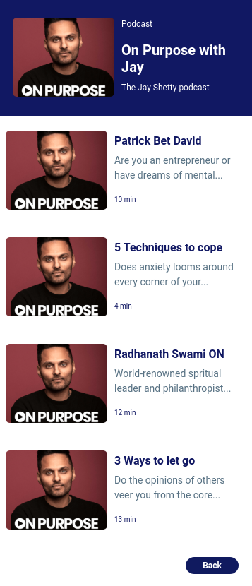
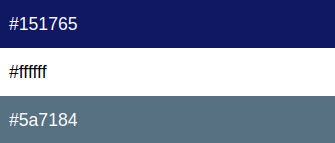

## Podcast Page

In this Project, let's build a News Page. We can use the Bootstrap concepts as well..

**Refer to the below images.**
- Podcast Home Page:
    - 

- Podcast Puri Jagannadh Page:
    - 

- Podcast Tedx Page:
    -  

- Podcast Sadhguru Page:
    -  

- Podcast On Purpose Page:
    - 

**Note**

When clicked on the Podcast category on the Podcast Home Page, it must display the respective person podcasts page and when the back button is clicked Podcast Home Page must be displayed.
Try to achieve the design as close as possible.

**Resources**
- Use the Image URLs given below.
- Background Image: 
    - https://d1tgh8fmlzexmh.cloudfront.net/ccbp-static-website/podcasts-bg.png

- Images:
    - https://d1tgh8fmlzexmh.cloudfront.net/ccbp-static-website/puri-jagannadh-img.png
    - https://d1tgh8fmlzexmh.cloudfront.net/ccbp-static-website/tedx-img.png
    - https://d1tgh8fmlzexmh.cloudfront.net/ccbp-static-website/sadhguru-img.png
    - https://d1tgh8fmlzexmh.cloudfront.net/ccbp-static-website/on-purpose-img.png

**CSS Colors used**
- Background color Hex Code values:
    - 

- Text color Hex Code values:
    - 

**CSS Font families used:**
- `Roboto`