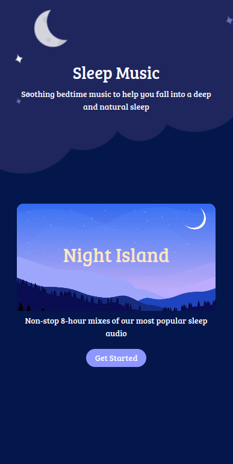
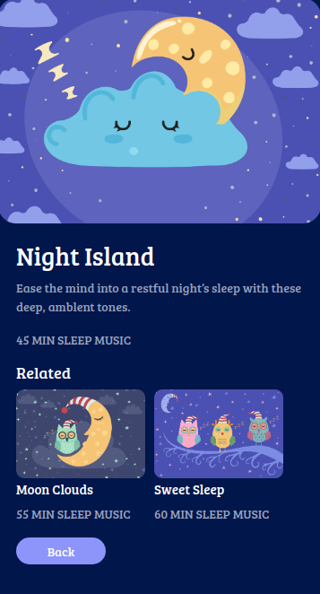
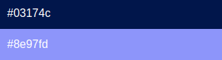
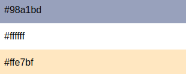

## Music Page

In this Project, let's build a News Page. We can use the Bootstrap concepts as well..

**Refer to the below images.**
- Music Home Page:
    - 

- Music Details Page:
    - 

**Note**
- When clicked on the Get Started button on the Music Home Page, it must display the Music Details Page.
- Try to achieve the design as close as possible.

**Use the Image URLs given below.**

- Music Home Page:
    - https://d1tgh8fmlzexmh.cloudfront.net/ccbp-static-website/moon-bg.png
    - https://new-assets.ccbp.in/frontend/static-website/moon-stars-bg.png

- Music Details Page:
    - https://d1tgh8fmlzexmh.cloudfront.net/ccbp-static-website/clouds-img.png
    - https://d1tgh8fmlzexmh.cloudfront.net/ccbp-static-website/moon-clouds-img.png
    - https://d1tgh8fmlzexmh.cloudfront.net/ccbp-static-website/sweet-sleep-img.png

**CSS Colors used**

- Background color Hex Code values:
    - 

- Text color Hex Code values:
    - 

**CSS Font families used:**
- `Bree Serif`