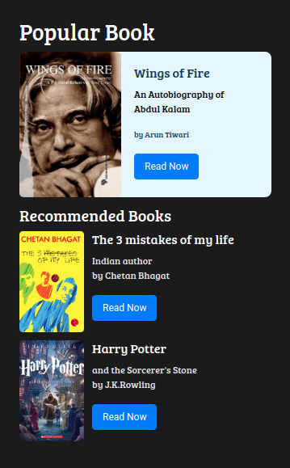
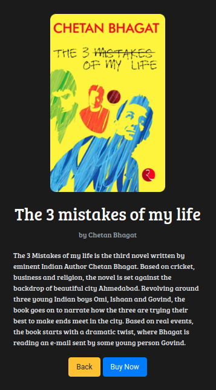
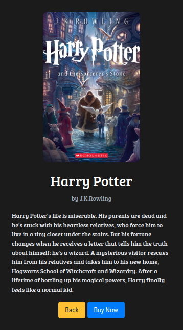
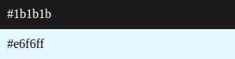
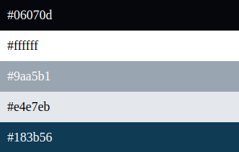

## Book Store Page

In this Project, let's build a News Page. We can use the Bootstrap concepts as well..

**Refer to the below images.**
- Book Store Home Page:
    -  

- Wings of fire book details Page:
    -   

- The 3 mistakes of my life book details Page:
    -  

- Harry Potter book details Page:
    - 

**Note**
- When clicked on the Read Now button on the Book Store Home Page, it must display the respective book details page.
- Try to achieve the design as close as possible.

**Resources**
Use the Image URLs given below.

- Images:
    - https://d1tgh8fmlzexmh.cloudfront.net/ccbp-static-website/book-apj-img.png
    - https://d1tgh8fmlzexmh.cloudfront.net/ccbp-static-website/book-chetan-bhagat-img.png
    - https://d1tgh8fmlzexmh.cloudfront.net/ccbp-static-website/harrypotter-img.png

**CSS Colors used**
- Background color Hex Code values:
    - 

- Text color Hex Code values:
    - 

- CSS Font families used:
    - `Roboto`
    - `Bree Serif`