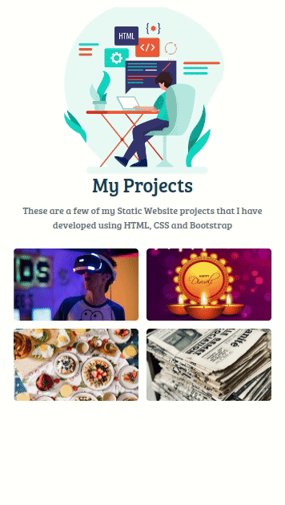
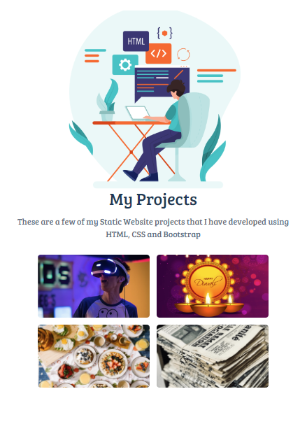
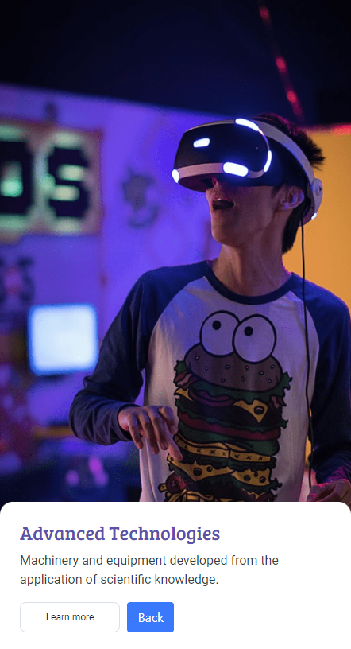
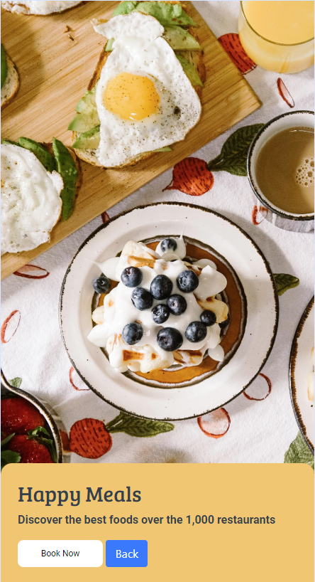
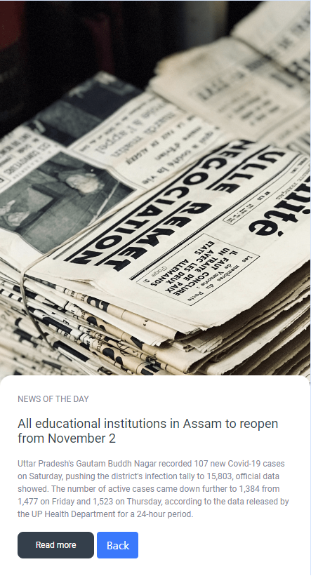
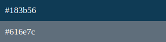

## My Projects Page

In this Project, let's build a News Page. We can use the Bootstrap concepts as well..

**Refer to the below gif image.**

 

**Design Files:**
- Home Page:
    - 

- Advanced Technologies Page:
    -    

- Diwali Page:
    - 

- Happy Meals Page:
    -  
 

- NewsPaper Article Page:
    - 

**Note**
- You can add more projects that you have completed.
- Try to achieve the design as close as possible.

**Resources**
- Use the Image URLs given below.
    - https://d1tgh8fmlzexmh.cloudfront.net/ccbp-static-website/software-developer-img.png
    - https://d1tgh8fmlzexmh.cloudfront.net/ccbp-static-website/advanced-technologies-img.png
    - https://d1tgh8fmlzexmh.cloudfront.net/ccbp-static-website/diwali-img.png
    - https://d1tgh8fmlzexmh.cloudfront.net/ccbp-static-website/food-img.png
    - https://d1tgh8fmlzexmh.cloudfront.net/ccbp-static-website/news-paper-img.png

**CSS Colors used**
- Text color Hex Code values:
    - 

- CSS Font families used:
    - `Bree Serif`

