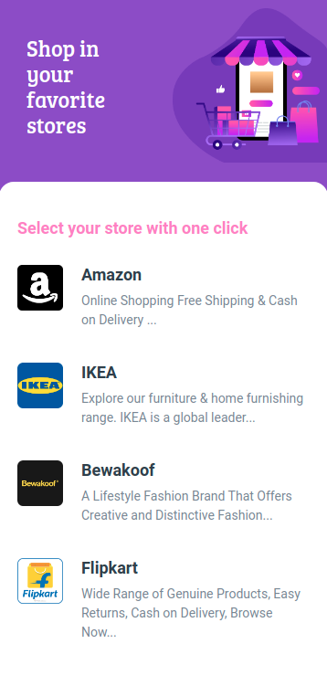

## Favorite Stores Page

In this Project, let's build a News Page. We can use the Bootstrap concepts as well..

**Refer to the below image.**

**Note**
- Try to achieve the design as close as possible.

**Resources**
- Use the image URLs given below.
    - https://assets.ccbp.in/frontend/static-website/stores-img.png
    - https://assets.ccbp.in/frontend/static-website/amazon-logo-img.png
    - https://assets.ccbp.in/frontend/static-website/ikea-logo-img.png
    - https://assets.ccbp.in/frontend/static-website/bewakoof-logo-img.png
    - https://assets.ccbp.in/frontend/static-website/flipkart-logo-img.png

**CSS Colors used:**

- Background color Hex Code values:
    - `#894bca`
    - `#ffffff`

**Text color Hex Code values:**
- `#f780c3`
- `#ffffff`
- `#323f4b`
- `#7b8794`

**CSS Font families used:**
- `Bree Serif`