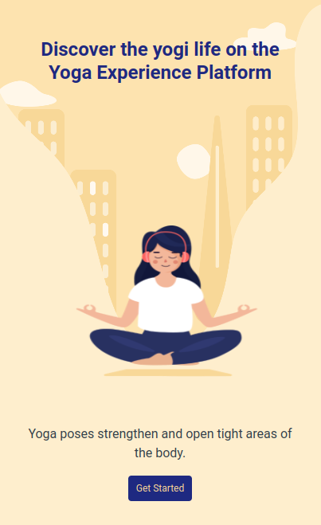
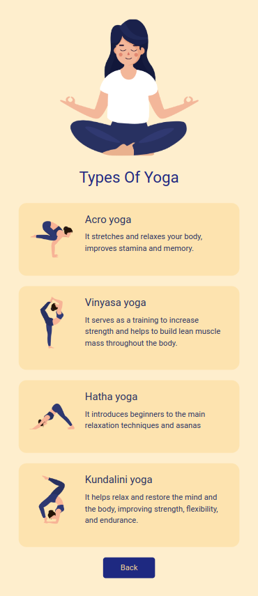

## Yoga Page

In this Project, let's build a News Page. We can use the Bootstrap concepts as well..

**Refer to the below images**

**Design Files:**

- Yoga Home Page:

- Types of Yoga Page:

 

**Note**
- When clicked on the Get Started button on the Yoga Home Page, it must display the Types of Yoga Page.
- Try to achieve the design as close as possible.

**Resources**

Use the image URLs given below.

- Home Page Background Image
    - https://assets.ccbp.in/frontend/static-website/yoga-bg.png

- Home Page Girl Image
    - https://assets.ccbp.in/frontend/static-website/yoga-girl-with-headphones-img.png

- Types of Yoga Page Images
    - https://assets.ccbp.in/frontend/static-website/yoga-girl-without-headphones-img.png
    - https://assets.ccbp.in/frontend/static-website/yoga-card1-img.png
    - https://assets.ccbp.in/frontend/static-website/yoga-card2-img.png
    - https://assets.ccbp.in/frontend/static-website/yoga-card3-img.png
    - https://assets.ccbp.in/frontend/static-website/yoga-card4-img.png

**CSS Colors used:**

- Background color Hex Code values:
    - `#ffedcb`
    - `#132d84`
    - `#ffe2ab`

- Text color Hex Code values:
    - `#323f4b`
    - `#fad693`
    - `#132d84`
    - `#253263`

**CSS Font families used:**
- `Roboto`