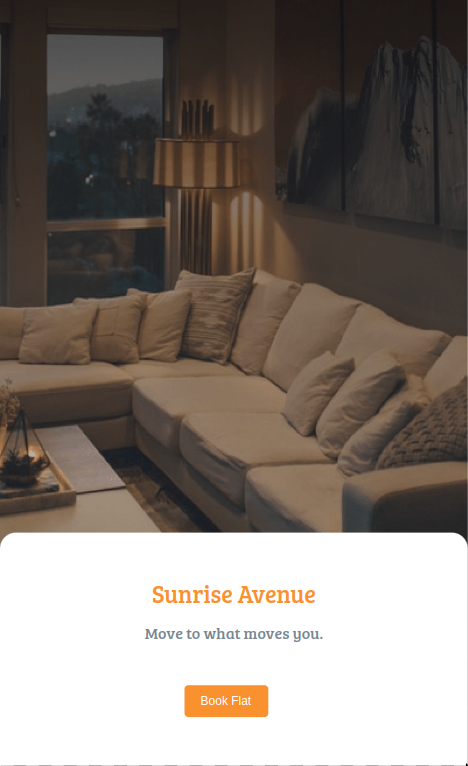
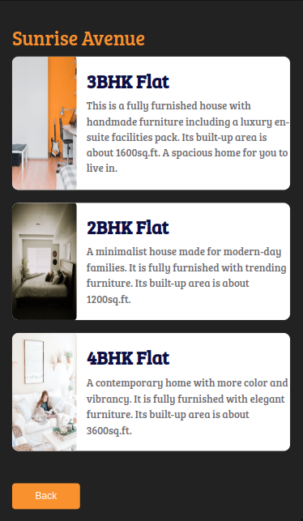
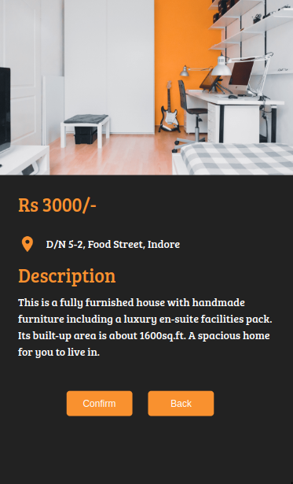
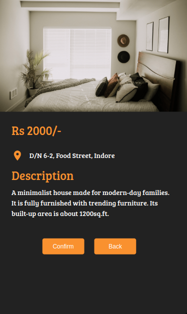
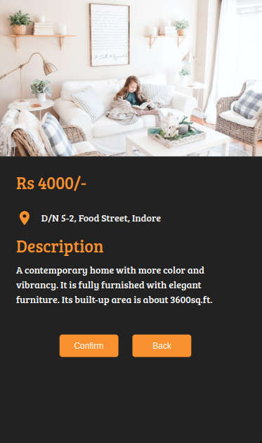

## Flats Page

In this Project, let's build a News Page. We can use the Bootstrap concepts as well..

**Refer to the below images.**

**Design Files:**
- Sunrise Avenue Home Page:

- Flats List Page:

- 3BHK Flat Page:

- 2BHK Flat Page:

- 4BHK Flat Page:

 

**Note**
- When clicked on the Book Flat button on the Sunrise Avenue Home Page, it must display the Flats List Page.
- When clicked on each flat in Flats List Page, it must display the respective Flat Details Page.
- When clicked on Confirm button in Flat Details Page, it must display Sunrise Avenue Home Page
- When clicked on Back button in Flat Details Page, it must display Flats List Page
- Try to achieve the design as close as possible.

**Resources**

Use the image URLs given below.

- Home Page Background Image
    - https://assets.ccbp.in/frontend/static-website/flats-list-bg.png

- Flats List Card Images
    - https://assets.ccbp.in/frontend/static-website/flats-list-card1-img.png
    - https://assets.ccbp.in/frontend/static-website/flats-list-card2-img.png
    - https://assets.ccbp.in/frontend/static-website/flats-list-card3-img.png

- Location Icon    - 
    - https://assets.ccbp.in/frontend/static-website/flats-list-location-icon-img.png

- Flats Description Images
    - https://assets.ccbp.in/frontend/static-website/flats-list-d1-img.png
    - https://assets.ccbp.in/frontend/static-website/flats-list-d2-img.png
    - https://assets.ccbp.in/frontend/static-website/flats-list-d3-img.png

**CSS Colors used:**

- Background color Hex Code values:
    - `#f19116`
    - `#222222`
    - `#ffffff`

- Text color Hex Code values:
    - `#f19116`
    - `#7b8794`
    - `#ffffff`
    - `#0f0e46`
    - `#6c6b70`

**CSS Font families used:**
- `Bree Serif`